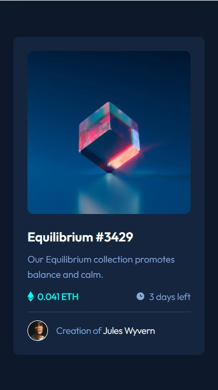
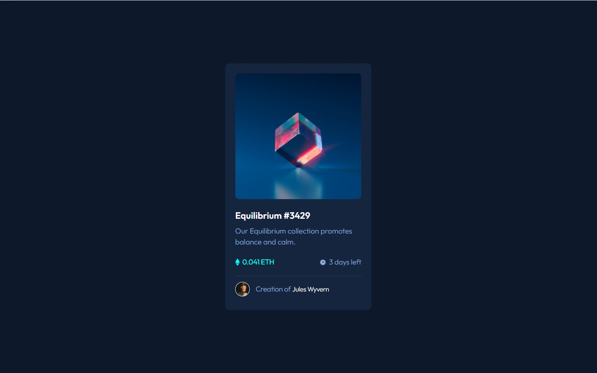

# Frontend Mentor - NFT preview card component solution

This is a solution to the [NFT preview card component challenge on Frontend Mentor](https://www.frontendmentor.io/challenges/nft-preview-card-component-SbdUL_w0U). Frontend Mentor challenges help you improve your coding skills by building realistic projects.  

## Table of contents

- [Overview](#overview)
  - [The challenge](#the-challenge)
  - [Screenshot](#screenshot)
  - [Links](#links)
- [My process](#my-process)
  - [Built with](#built-with)
  - [What I learned](#what-i-learned)
  - [Continued development](#continued-development)
  - [Useful resources](#useful-resources)
- [Author](#author)

## Overview

### The challenge

Users should be able to:

- View the optimal layout depending on their device's screen size
- See hover states for interactive elements

### Screenshot
<div>
  
  
</div>

### Links

- Solution URL: [My solution URL](https://github.com/MiloosN5/FrontendMentor_NFTPreviewCard)
- Live Site URL: [My live site URL](https://miloosn5.github.io/FrontendMentor_NFTPreviewCard/)


## My process

### Built with

- Semantic HTML5 markup
- SASS - compiled into the CSS
- BEM
- Flexbox
- Mobile-first workflow
- REM (Root EM) & EM (for Responsive)
- Responsive layout
- NPM
- Gulp
- JavaScript

### What I learned

* Organizing & optimizing my sass code using mixins, classes, placeholders, variables & functions. Since there are used so many different mixins (as a templates), all variables are putted in lists, rather than each one writting as a individual variables. Using 'map.get' you can connect your desired text value with the key in the list.<br/>
**Note** When using map.get, don't forget to include 'map'.

  * using values from lists 
    ```scss
        @use "sass:map";
        ...
        @mixin overflow($overflow) {
            overflow: map.get(v.$overflow, $overflow);
        }
    ```
    ```scss
        $overflow: (
          'o-auto': auto,
          'o-hidden': hidden,
        );
    ```
    ```scss
        @include a.overflow('o-hidden');
    ```
      
* Using gulp as a toolkit to automate & enhance workflow. It can compiled our files such as .scss into .css. Also, one of its adventages is automatic 'refresh' of our page when some changes occured in our workspace. Using our custom made 'watch task' we defined where our server will start and which files to observe. If something changed in these files, thanks to 'browser-sync' our page will be refreshed. All tasks need to be exported.<br/>
**Note** After everything is set up, we can launch our 'gulp' using 'gulp watch'. Then, we don't need to manually refresh page or call 'gulp watch' again, gulp will do it automatically. 

  * installing gulp-cli, gulp, gulp-sass & browser-sync
    ```
        npm install gulp-cli -global
        npm install --save-dev gulp gulp-sass browser-sync 
    ```

  * gulpfile.js (setting things up) - two main tasks (style & watch)
    ```js
        function style() {
            // 1. where is my scss file
            return gulp.src('./scss/**/*.scss')
            // 2. pass that file through sass compiler
                .pipe(sass().on('error', sass.logError))
            // 3. ehere do I save the compiled CSS?
                .pipe(gulp.dest('./css'))
            // 4. stream changes to all browser
                .pipe(browserSync.stream());
        }
        function watch() {
            browserSync.init({
                server: {
                    baseDir: './'
                }
            });
            gulp.watch('./scss/**/*.scss', style);
            gulp.watch('./*.html').on('change', browserSync.reload);
            gulp.watch('./*.js').on('change', browserSync.reload);
        }

        exports.style = style;
        exports.watch = watch;
    ```

### Continued development

* Learning more about Gulp (with the accent on series & parallel).

### Useful resources

- [Gulp v4 - Sass and BrowserSync setup - Kevin Powell (Youtube)](https://www.youtube.com/watch?v=QgMQeLymAdU) - Learn how to setup basic gulfile.js file.
- [SASS](https://sass-lang.com/documentation/at-rules) - You can found detailed documentation on the official page of the SASS. Check out for example "at-rules".
- [7-1 pattern SASS](https://sass-guidelin.es/#component-structure) - "7-1" pattern is one of the most used sass organization. It is also very pratical. 
- [Clamp calculator](https://royalfig.github.io/fluid-typography-calculator/) - Since there are so many different devices, desirable is to make your font fluid from one size to another.
- [Media Query](https://css-tricks.com/a-complete-guide-to-css-media-queries/) - A Complete Guide to (CSS) Media Queries.
- [Responsive images](https://developer.mozilla.org/en-US/docs/Learn/HTML/Multimedia_and_embedding/Responsive_images) - How to make images responsive.
- [Typographic Hierarchy](https://www.toptal.com/designers/typography/typographic-hierarchy) - Understanding your website structure/hierarchy sometimes can be difficult. Determing accurately typography can be half job done. 

## Author

- GitHub - [MiloosN5](https://github.com/MiloosN5)
- Frontend Mentor - [@MiloosN5](https://www.frontendmentor.io/profile/MiloosN5)


